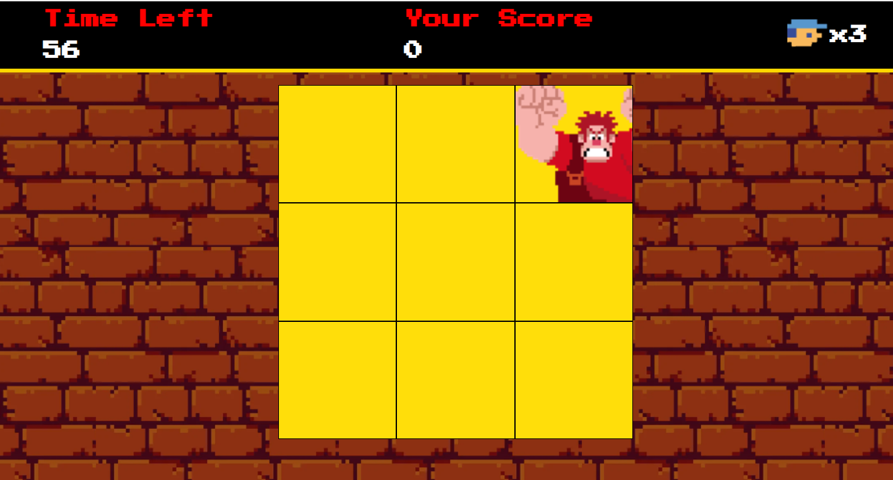

# Detona Ralph Game

Um projeto de HTML, CSS e JavaScript inspirado no filme **Detona Ralph**. O objetivo do jogo é acertar o Ralph na janela em que ele aparecer, praticando eventos JavaScript e manipulação de áudios no navegador.



## Demonstração

Veja o site funcionando através do GitHub Pages:

[](https://tremedam.github.io/Detona_Ralph_Game/)

## Funcionalidades

- Interface retrô inspirada em jogos clássicos.
- Ralph aparece aleatoriamente em diferentes janelas.
- Pontuação e tempo exibidos em tempo real.
- Efeitos sonoros ao acertar o Ralph.

## Tecnologias

- HTML5
- CSS3
- JavaScript

## Como rodar localmente

1. Clone o repositório:
    ```sh
    git clone https://github.com/SEU_USUARIO/SEU_REPOSITORIO.git
    ```
2. Abra o arquivo `index.html` no seu navegador.

## Licença

Este projeto está licenciado sob a licença MIT. Veja o arquivo [LICENSE](LICENSE) para mais detalhes.